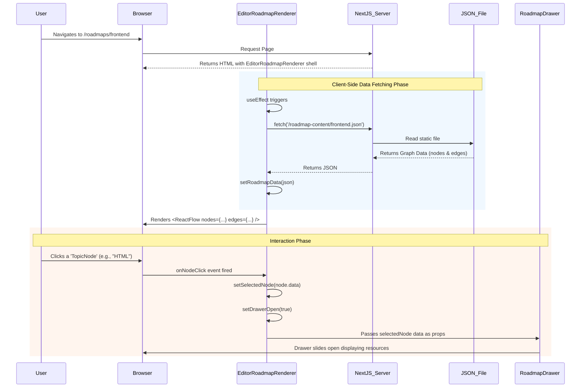

# Data Flow Document
**Project:** Nocturnal Codex

This document maps out the lifecycle of data in the Nocturnal Codex application, detailing exactly how JSON and Markdown data travels from content files into the React components, from the server down to the client's screen.

## 1. Roadmap Data Flow (JSON -> React Flow)

The roadmap feature relies heavily on client-side fetching because the React Flow library requires exact DOM measurements and browser APIs to render the graph correctly.

### Visualization



### Step-by-Step Breakdown
1. **The Request**: The user hits `/roadmaps/[roadmapId]`. The Next.js server returns the basic HTML structure.
2. **The Fetch**: Inside `EditorRoadmapRenderer.tsx` (a Client Component), a `useEffect` hook runs on mount. It executes a `fetch()` request to the static `public/roadmap-content/` directory.
3. **State Update**: The JSON response (containing arrays of `nodes` and `edges`) is stored in the `roadmapData` React state.
4. **Rendering**: The `<ReactFlow>` component receives `roadmapData.nodes` and maps each item to its corresponding custom component (like `TopicNode`) based on the `type` property in the JSON.
5. **Interaction**: When a user clicks a node, the custom `onNodeClick` function fires. It extracts the `data` payload attached to that specific node (which contains things like tutorial links) and updates the `selectedNode` state. This state change forces the `RoadmapDrawer` to re-render and slide open, populated with the specific data.

---

## 2. Markdown Content Flow (Local Files -> Server Components)

For structured textual content like the Programming Languages curriculum, data flows strictly on the server side to ensure SEO and fast initial page loads.

### Visualization

```mermaid
flowchart TD
    subgraph "Data Layer (Filesystem)"
        A[src/content/languages/rust/index.md]
        B[src/content/languages/rust/ownership.md]
    end

    subgraph "Library Layer (Server)"
        C[src/lib/languages.ts\nfs.readFileSync() & gray-matter]
    end

    subgraph "Page Layer (Server Components)"
        D[src/app/languages/[slug]/page.tsx]
        E[src/app/languages/[slug]/[topicSlug]/page.tsx]
    end

    subgraph "Presentation Layer (Client)"
        F[Browser / HTML Output]
    end

    A -->|Raw Markdown| C
    B -->|Raw Markdown| C
    
    C -->|Parsed Object:\n{ title: 'Rust', content: '...' }| D
    C -->|Parsed Object:\n{ title: 'Ownership', content: '...' }| E

    D -->|Prop Drilling| F
    E -->|react-markdown rendering| F
```

### Step-by-Step Breakdown
1. **File Read**: At build time or request time (depending on caching), Next.js calls a function in `src/lib/languages.ts`. This function uses the Node.js `fs` module to read raw `.md` files from the disk.
2. **Parsing**: The raw string is passed to `gray-matter`, which separates the YAML Frontmatter (metadata like `title`, `description`) from the Markdown body.
3. **Server Component**: The parsed JavaScript object is returned directly into a Server Component like `src/app/languages/[slug]/page.tsx`. 
4. **Rendering**: The Server Component passes the raw markdown string as a prop to a client component (like `<MarkdownRenderer>`), which uses `react-markdown` to convert the markdown syntax into styled HTML elements (h1, p, code blocks) before sending the final HTML to the browser.
