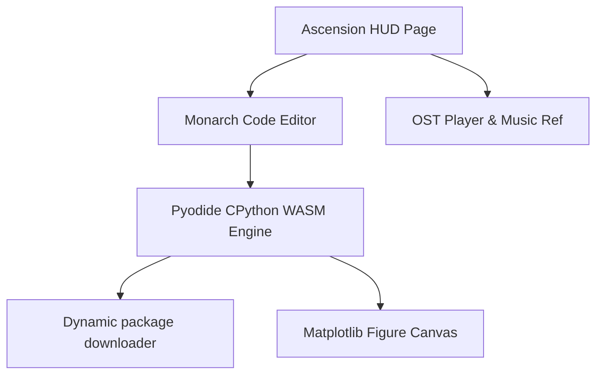

# System: Python Ascension Protocol Document

Welcome, Hunter, to the **System: Python Ascension Protocol** documentation. This document outlines the architecture, layout, core mechanics, audio subsystems, and the dynamic CPython WebAssembly engine driving the Python training environment.

---

## 🔮 1. Core Architecture Overview

The Ascension Protocol page `/python` acts as an interactive Solo Leveling coding simulator where Hunters execute real Python scripts in their browser.

---

## 🎮 2. Main System Modules & Interface Sections

### 👑 A. Archives Header Banner
- **Portal Glow Effect**: Triple blur ambient color shifting backgrounds reacting to pointer positions.
- **WASM Status Badge**: Reflects active status of browser's CPython 3.12 engine.
- **Export Lab Report**: Renders completed task logs, certification, and Hunter details as markdown files.
- **Test Penalty Zone Trigger**: Simulates daily quest penalties immediately.

### 📻 B. Compact Solo Leveling OST Player
- **Real Audio Engine**: Houses official high-fidelity mp3 files from `docs/music/` (`SymphonicSuite-Lv.6.mp3`, `aikari.mp3`).
- **Live EQ Bar Visualizer**: Animated equalizer bands wiggling in time with track playback.
- **Integrated controls**: Play/Pause toggle, Next Track, Mute/Unmute, and Volume sliders.

### 🛡️ C. Hunter Identity Card HUD
- **Rank Indicator**: Displays level, current rank (e.g. S-Rank), and guild alliance.
- **System Experience Fill Bar**: Displays experience progress toward S-Class Monarch Level (Max Level 999).
- **Aura Theme Switcher**:
  - 🟣 **Purple**: Pulse effect mapping to Shadow Monarch theme.
  - 🟡 **Gold**: Thunder glow mapping to Monarch Gold theme.
  - 🔵 **Cyber**: Tech grid pulsing glow.
- **Global Difficulty Mode Switcher**:
  - **Easy (1.0x)**: Standard starter code.
  - **Hard (1.5x)**: Introduces syntax errors / bugs into task code blocks.
  - **Hell (2.0x)**: Blank editor requiring script entry from memory.

---

## 🐍 3. CPython 3.12 WebAssembly Interpreter

- **Library Engine**: Utilizes [Pyodide](https://pyodide.org/) loading live inside the browser sandbox.
- **Auto-Package Loader**: Scans incoming Python code for imports (`numpy`, `pandas`, `matplotlib`) and fetches target WASM packages on-demand.
- **Headless Agg Canvas backend**: Automatically overrides Matplotlib's window engine to redirect outputs to base64 images, rendered dynamically as inline terminal cards.

---

## 🚨 4. System Penalty Zone Dungeons

- **Trigger Condition**: Failing script validation 3 consecutive times.
- **Simulation**: Teleports the Hunter into the **Desert of Giant Centipedes** under a 60-second countdown.
- **Escape Route**: Solve 3 rapid-fire debugging problems in sequence to escape. Failure results in a `-50 XP` experience penalty.
