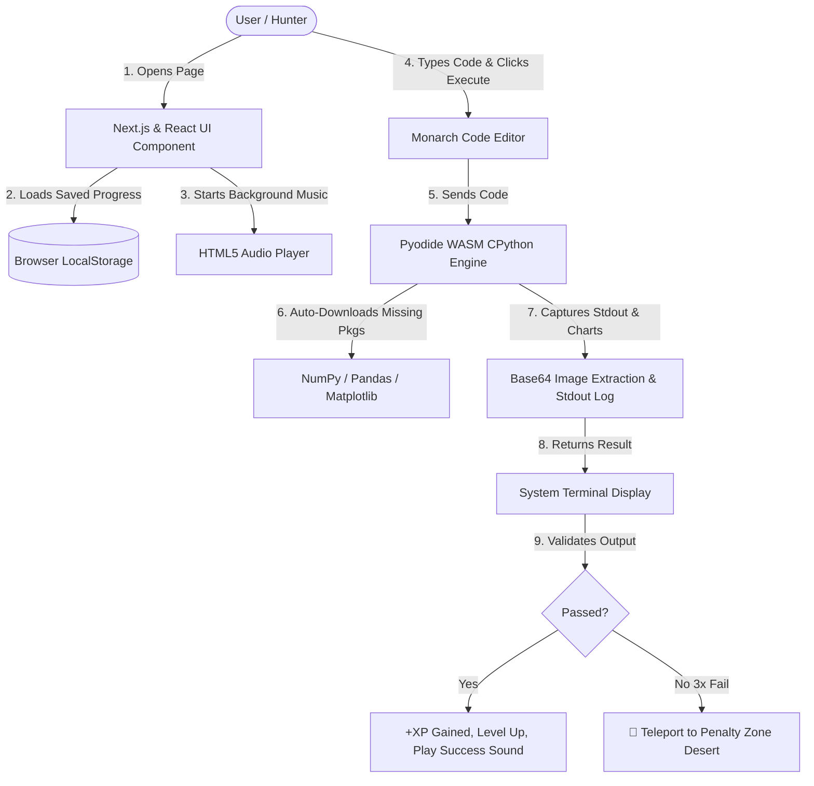

# System: Python Ascension Protocol — Technical & Architecture Guide

Welcome to the official documentation for **The System: Python Ascension Protocol** (`/python`). 

This document explains **what technologies power this application**, **why each technology was chosen**, and **how they all work together seamlessly** in simple, easy-to-understand language.

---

## 🌟 1. Executive Summary (What is this Page?)

**The System: Python Ascension Protocol** is an interactive, gamified Python learning platform inspired by *Solo Leveling*. 

Instead of reading boring textbook code, users play as a **Hunter (ID #041)** who clears dungeon gates, solves Python lab experiments, earns Experience Points (XP), levels up to the **Shadow Monarch Class (Level 999)**, listens to epic OST music, and exports official assignment reports for their professors.

All Python code runs **directly inside your web browser** with zero setup, zero installation, and no external server required!

---

## 🛠️ 2. Technologies Used & Why We Used Them

Here is a simple breakdown of every technology built into this system, what it does, and why we selected it:

| Technology | What it is | Why We Used It (Simple Explanation) |
| :--- | :--- | :--- |
| **React 18 & Next.js 14** | Modern Web Application Framework | **Fast & Smooth Page Loading**: Allows the app to feel like a high-speed video game UI where tabs, modals, and buttons update instantly without refreshing the browser page. |
| **TypeScript** | Strongly Typed JavaScript | **Bug-Free Reliability**: Catches code errors before they happen, making sure Hunter stats, dungeon progress, and inventory items never glitch or get lost. |
| **Tailwind CSS & Glassmorphism** | Modern Design & Styling Framework | **Stunning Futuristic Aesthetics**: Creates vibrant dark-mode visuals, glowing energy auras (Purple, Gold, Cyber), sleek neon borders, and responsive layouts that WOW the user. |
| **Pyodide (CPython 3.12 WebAssembly)** | Real Python Engine in the Browser | **No Python Installation Needed**: Runs real, full CPython 3.12 directly in the user's web browser using WebAssembly (WASM). Users don't need Python installed on their computer! |
| **NumPy & Pandas (WASM Packages)** | Data Science & Analysis Libraries | **Real Lab Experiments**: Enables users to solve matrix math, statistics, data cleaning, and dataset filtering tasks just like real data scientists. |
| **Matplotlib (Agg Backend)** | Data Visualization & Chart Library | **Graphical Plot Output**: Generates live line charts, bar graphs, scatter plots, and pie charts directly in the terminal window using Base64 PNG image canvas extraction. |
| **HTML5 Audio & Web Audio API** | Browser Audio Engines | **Immersive OST & Sound FX**: Plays high-fidelity mp3 soundtracks (*Solo Leveling Symphonic Suite*) and generates procedural retro sound effects for button clicks, level-ups, and victory sounds. |
| **Lucide React Icons** | Futuristic Vector Icon Library | **Visual Cues & HUD Graphics**: Provides sharp, high-tech icons (Shields, Swords, Crowns, Flames, Radios, CPU badges) to make every button intuitive. |
| **Browser LocalStorage** | Browser Storage Engine | **Automatic Progress Save**: Automatically saves Hunter XP, level, cleared dungeons, unlocked achievements, and selected aura theme so progress is never lost when closing the tab. |
| **Markdown Blob Exporter** | File Generation Engine | **1-Click Professor Assignment Export**: Compiles all finished lab experiments, code solutions, output logs, and Hunter ID #041 grade certification into a downloadable `.md` assignment file ready for grading. |

---

## 🔄 3. How All Technologies Work Together (Step-by-Step Flow)

Here is how the entire system functions under the hood in simple terms when a user interacts with the app:

### 🔹 Step 1: Page Launch & Storage Hydration
When the user opens `/python`, **React & Next.js** load the interface. The system checks **LocalStorage** to restore saved progress (XP, level, completed dungeons, and selected aura glow).

### 🔹 Step 2: Audio & OST Initialization
The **HTML5 Audio Engine** loads the *Solo Leveling Symphonic Suite* MP3 track from `docs/music/` and plays background audio with an interactive **Animated Equalizer Bar** visualizer.

### 🔹 Step 3: Python Script Execution
When the user clicks **"Run Python Program"**:
1. The code text is sent to **Pyodide (WebAssembly CPython 3.12)**.
2. If the user's code contains `import numpy`, `import pandas`, or `import matplotlib`, Pyodide automatically fetches those packages in the background.
3. CPython executes the Python code safely inside the browser sandbox.

### 🔹 Step 4: Graphical Visual Output Generation
If the user's Python script calls `plt.show()` or generates Matplotlib charts:
1. Pyodide captures the figure canvas into a high-DPI **Base64 PNG image stream**.
2. The UI extracts this image stream and renders a **Graphical Canvas Figure Output Card** directly below the text terminal output.

### 🔹 Step 5: Mission Validation & Progression
1. The terminal output is compared against expected experiment criteria.
2. **On Success**: Victory sound plays (`Web Audio API`), XP is awarded, and the next dungeon gate unlocks!
3. **On 3 Consecutive Failures**: The System triggers an emergency alert and teleports the user into the **Penalty Zone (Desert of Giant Centipedes)** with a 60-second survival countdown timer!

---

## 🎯 4. Detailed Feature Breakdown

### 👑 1. System Archives & Hunter Identity HUD
- **System Header Banner**: Features triple-layer ambient glow fields, real CPython WASM engine status indicators, and quick action controls.
- **Hunter Card**: Displays Hunter Name (**Akhanda - ID #041**), Rank Level, Guild affiliation (**Ahjin Guild**), and an animated **Monarch Ascension Progress Bar**.
- **Aura Customization**: Toggle between 🟣 **Shadow Monarch Purple Pulse**, 🟡 **Monarch Gold Thunder**, and 🔵 **System Cyber Blue Grid** themes.

### ⚔️ 2. Eleven (11) Interactive Dungeon Gates
1. **Dungeon 1**: Gate of Genesis (Variables & Output)
2. **Dungeon 2**: Cavern of Control (Conditionals & Logic)
3. **Dungeon 3**: Labyrinth of Loops (Iterative Structures)
4. **Dungeon 4**: Vault of Functions (Modularity & Scope)
5. **Dungeon 5**: Citadel of Data (Lists, Tuples, Sets, Dicts)
6. **Dungeon 6**: Spire of Objects (OOP & Inheritance)
7. **Dungeon 7**: Tomb of Exceptions (Error Handling)
8. **Dungeon 8**: Sanctum of Files (I/O & Persistence)
9. **Dungeon 9**: Realm of Algorithms (Recursion & Sorting)
10. **Dungeon 10**: Final Dungeon: Data Observatory (NumPy, Pandas, Matplotlib)
11. **Dungeon 11**: Secret Gate: Throne of the Shadow Monarch (Class Ascension)

### 🚨 3. Emergency Penalty Zone
- Modeled after the famous Solo Leveling Daily Quest Penalty!
- Triggers upon 3 consecutive code failures or manual activation.
- Features a glowing red emergency HUD, 60-second countdown, and 3 rapid-fire survival code debug challenges.

### 📄 4. 1-Click Official Lab Assignment Exporter
- Perfect for college grading and professor evaluation!
- Compiles Hunter ID #041 credentials, completed experiments, full code solutions, expected vs actual output logs, and an official **A+ S-Rank Distinction Grade Certificate** into a single downloadable Markdown report (`.md`).

---

## 💡 5. Summary for Evaluators & Non-Technical Readers

- **Zero Friction**: No server setup, no Python installation, and no database configuration needed. Everything works out of the box in any web browser.
- **Educational Gamification**: Turns routine programming assignments into an addictive RPG experience.
- **Production Grade Code**: Built with modern web standards (React 18, Next.js 14, WebAssembly, HTML5 Audio, Base64 Graphics Engine).

---
*Documentation maintained by Nocturnal Codex Development Team.*
